# Lab6Web

## Membuat layout web sederhana menggunakan css framework (Twitter Bootstrap)

Pertama kita unduh terlebih dahulu bootstrapnya melalui link berikut `http://getbootstrap.com/`, jika sudah kemudian extrat file nya.
Setelah itu kita buat file html baru dengan nama `index.html`, kemudian masukan kodingan berikut.
Disini saya menggunakan bootstrap pada saat membuat navbar.

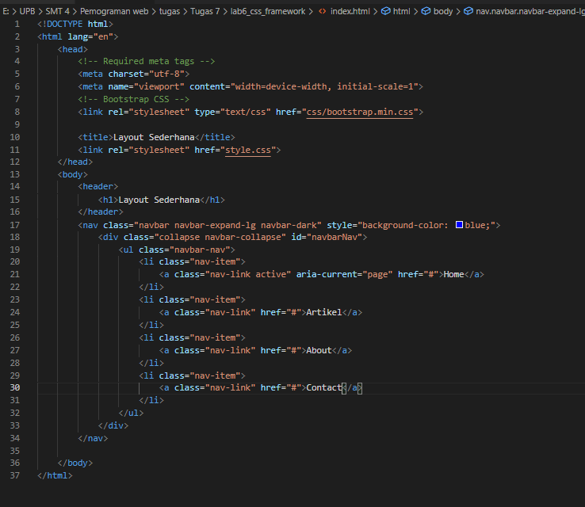

Buka tampilan browser untuk melihat hasilnya.

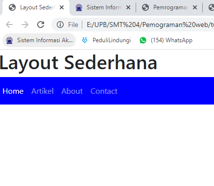

dan membuat isi dari `<body>` menggunkan bootstrap `jumbotron`.

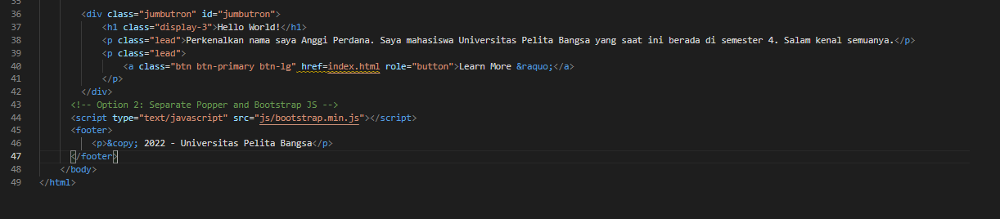

Deklarasikan dengan CSS.

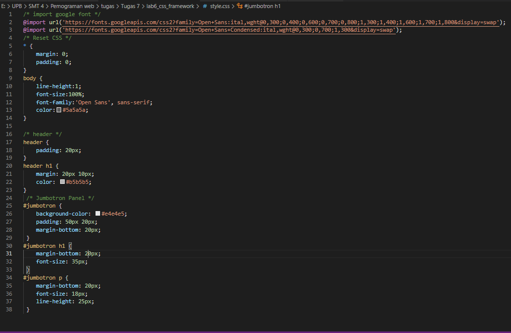

Refresh tampilan browser untuk melihat perubahannya.

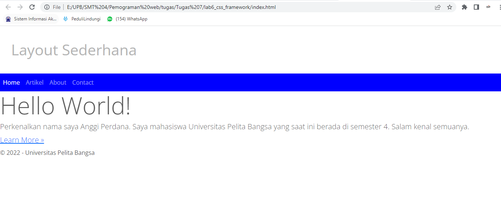

Kemudian kita bisa membuat artikel, dengan menggunakan kode seperti berikut ini.

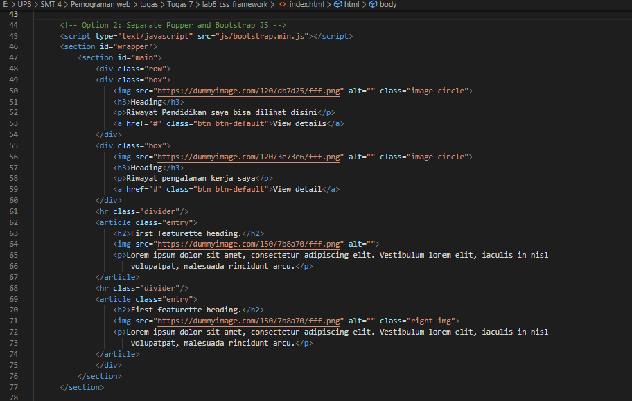

Deklarasikan dengan CSS.

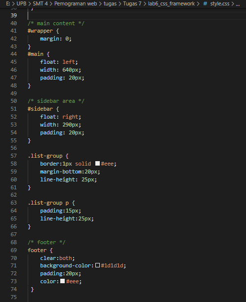

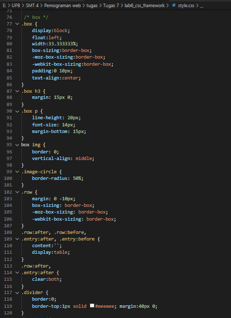

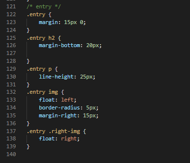

Tampilan pada website akan seperti berikut.

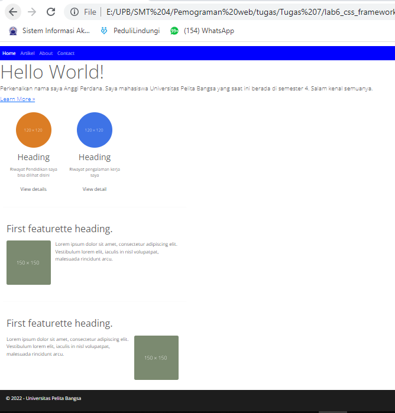

Kemudian kita akan membuat Widget Sidebar, disini saya menggunkan bootstrap `list-group`, kodinganya seperti berikut ini.

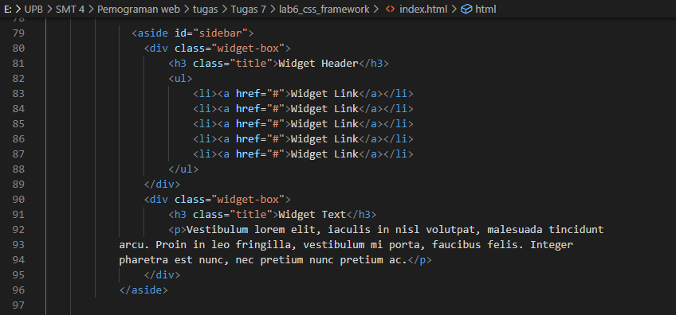

Deklarasikan dengan CSS.

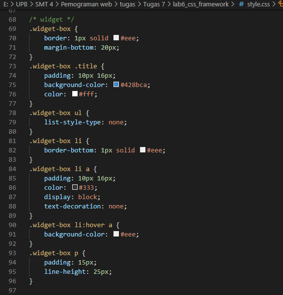

Tampilan websitenya seperti ini.

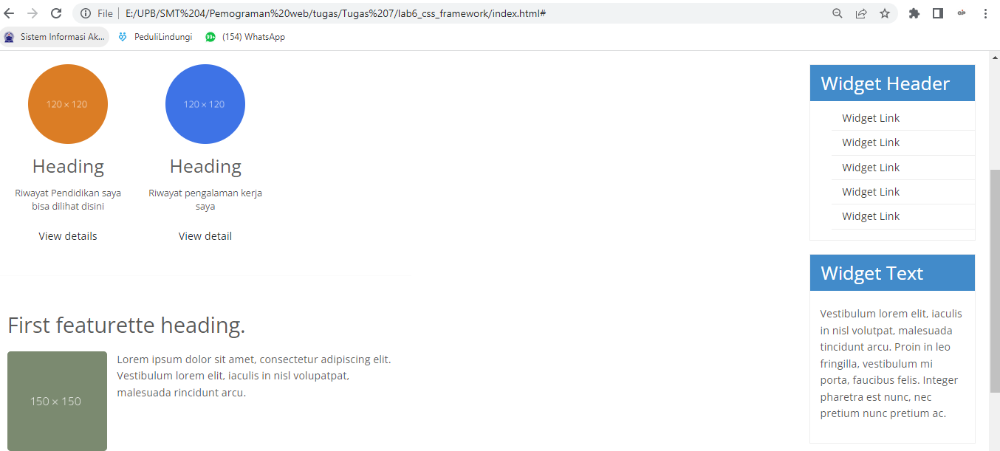

### Berikut ini tampilan keseluruhan Website

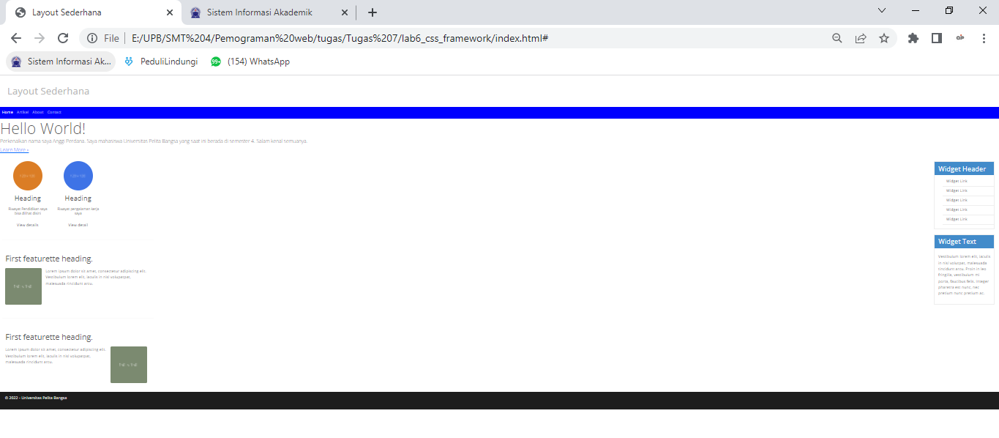

Demikian sedikit contoh tentang penggunaan bootstrap.